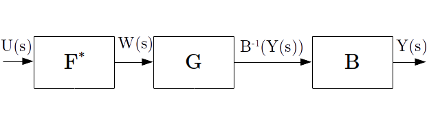

# Implementação de uma rede neural artificial para pré-compensação de não-linearidade em sistema mecânico
Trabalho de Conclusão de Curso em Engenharia Mecatrônica do CEFET-MG Campus Divinópolis. Implementação de uma rede neural artificial para pré-compensação de não-linearidade em sistema mecânico.

## Resumo
O projeto de controladores baseados na alocação de polos da função de transferência do sistema requer que os modelos dinâmicos sejam lineares. Contudo, algumas não-linearidades intrínsecas do sistema podem causar inadequações de critérios de desempenho. O trabalho consiste na implementação de um filtro não-linear baseado em redes neurais artificiais, com o objetivo de mitigar os efeitos não-lineares do sistema.  

## Requisitos
- [Python 3](https://www.python.org/downloads/) 
- Módulos [TensorFlow](https://www.tensorflow.org/install), [Keras](https://keras.io/#installation), [NumPy](https://docs.scipy.org/doc/numpy-1.15.0/user/install.html), [SciPy](https://www.scipy.org/install.html), [SKLearn](https://scikit-learn.org/stable/install.html), [EzODF](https://pypi.org/project/ezodf/), [Control](https://python-control.readthedocs.io/en/0.8.0/intro.html#installation) e [Matplotlib](https://matplotlib.org/3.1.0/users/installing.html) 
- [Matlab](https://www.mathworks.com/downloads/) (r2016b ou superior com pacote Simulink)

## Como funciona
Para um sistema de dinâmica linear modelada por <a href="https://www.codecogs.com/eqnedit.php?latex=G(s)" target="_blank"></a> e característica estática não linear <a href="https://www.codecogs.com/eqnedit.php?latex=B(\cdot&space;)" target="_blank"></a>, o filtro <a href="https://www.codecogs.com/eqnedit.php?latex=F^{*}" target="_blank"></a> processa o sinal de controle <a href="https://www.codecogs.com/eqnedit.php?latex=U(s)" target="_blank"></a> de forma a gerar um sinal <a href="https://www.codecogs.com/eqnedit.php?latex=W(s)" target="_blank"></a> que excita a dinâmica linear do sistema, fazendo com que a mesma responda com <a href="https://www.codecogs.com/eqnedit.php?latex=B^{-1}(Y(s))" target="_blank"></a>, cancelando parcialmente ou integralmenteo os efeitos da não-lienaridade. <a href="https://www.codecogs.com/eqnedit.php?latex=Y(s)" target="_blank"></a> representa a saída linear esperada, como mostra a Figura abaixo:



Para que o projeto do pré-compensador seja possível, é assumido que <a href="https://www.codecogs.com/eqnedit.php?latex=B^{-1}" target="_blank"></a> possa ser aproximada pela rede neural.

#### Levantando modelos
O treinamento da rede neural envolve três parâmetros fundamentais: a entrada do sistema, a saída esperada (produzida pelo modelo linear) e a saída real (produzida pelo modelo não-linear). O problema do efeito não linear pode ser descrito por um modelo de [Wiener](https://www.it.uu.se/katalog/tw/research/WienerIdentification), [Hammerstein](https://www.researchgate.net/figure/Hammerstein-and-Wiener-models-Fuzzy-System-Fuzzy-Systems-or-knowledge-based-systems-are-a_fig2_221787506) ou uma [combinação de ambos](https://www.mathworks.com/help/ident/ug/what-are-hammerstein-wiener-models.html). Esteja atento ao modelo a ser utilizado para treino e simulação. Um código em Python deve ser escrito para levantamento dos modelos de <a href="https://www.codecogs.com/eqnedit.php?latex=G(s)" target="_blank"></a> e, se possível, <a href="https://www.codecogs.com/eqnedit.php?latex=B(\cdot)" target="_blank"></a>.

```python
# Modelo linear:
from control.matlab import TransferFunction
G = TransferFunction ([4], [1, 4]) # Modelo G(s) = 4 / (s + 4)

# Modelo nao-linear:
from numpy import exp
B = lambda y : [2 / (1 + exp(-y_k)) - 0.5 for y_k in y] # Modelo B(y) = 2 / (1 + e^{-y}) - 0.5
```
#### Criando entradas e saidas
Uma vez levantados os modelos, é necessário produzir o sinal de controle <a href="https://www.codecogs.com/eqnedit.php?latex=u(t)" target="_blank"></a>, a correspondente saída esperada linear <a href="https://www.codecogs.com/eqnedit.php?latex=y(t)&space;=&space;(u&space;*&space;g)(t)" target="_blank"></a> e a resposta não-linear simulada <a href="https://www.codecogs.com/eqnedit.php?latex=B(y(t))" target="_blank"></a>. Continue com o código:

```python
# Sinal de entrada e tempo de simulacao:
from numpy import linspace, random
t = linspace (0, 10, 1000) #T_s = 0.01 segundos
u = random.uniform(low = -1, high = 1, size = len(t))

# Saida esperada e real:
y_esp, _, _ = lsim (G, t, u)
y_real = B(y_esp)
 ``` 
 #### Criando a rede
 Com o pacote _Keras_, é fácil projetar uma rede neural para treinamento. Ao usar em um ambiente com poucos recursos computacionais, entretanto, recomenda-se programar o algoritmo de _forward propagation_ "na mão". Neste exemplo, será projetada uma rede MLP (<a href="https://www.codecogs.com/eqnedit.php?latex=L&space;=&space;1" target="_blank"></a> camadas) para um sistema SISO. A função de ativação da rede será <a href="https://www.codecogs.com/eqnedit.php?latex=f_k(x)&space;=&space;x^3" target="_blank"></a> com ajuste escalar (linear) na saída. O vetor de pesos terá dimensão 15.
 ```python
# Importando as funcionalidades do Keras:
from tensorflow.python.keras.models import Sequential
from tensorflow.python.keras.layers import Dense 

# Criando funcao de ativacao:
from numpy import power
def cubic (x):
   return power (x, 3)

# Criando camadas:
L_1 = Dense (15, input_dim = 1, activation = cubic, name = 'L_1')
L_2 = Dense (1, activation = 'linear', name = 'L_2')

# Criando modelo:
F_estr = Sequential ()
F_estr.add (L_1)
F_estr.add (L_2)
```

#### Treinando a rede
Tendo a rede criada, é necessário compilar (atribuir métodos de otimização) e fazer o treinamento. Nesta etapa, criaremos também dados de validação do treino, como a resposta <a href="https://www.codecogs.com/eqnedit.php?latex=y_{val}(t)" target="_blank"></a> do sistema ao sinal <a href="https://www.codecogs.com/eqnedit.php?latex=v(t)" target="_blank"></a>. A função de custo será <a href="https://www.codecogs.com/eqnedit.php?latex=J(y,&space;\hat{y})&space;=&space;\ln&space;\cosh&space;(y&space;-&space;\hat{y})" target="_blank"></a>, e minimizada pelo método do Gradiente Descendente.
```python
# Criando sinais de validação:
v = random.uniform (high = 10, low = 0, size = len(t))
y_val, _, _ = lsim (G, v, t)
y_vr = B(y_val)

# Treinando modelo:
F_estr.compile (loss = 'logcosh', optimizer = 'sgd', metrics = ['mse', 'mae'])
F_estr.fit(y_real, y_esp, epochs=1000, batch_size=20,
           verbose=2, validation_data = (y_vr, y_val))
```

#### Comparando resultados

```python
# Calcula e aplica w(t):
w = F_estr.predict(u)
y_rna, _, _ = lsim (G, w, t)

# Compara a soma do erro absoluto:
r = [abs (y1 - y2) for y1 in y_esp for y2 in y_rna]
print ("Erro = ", r)
```
